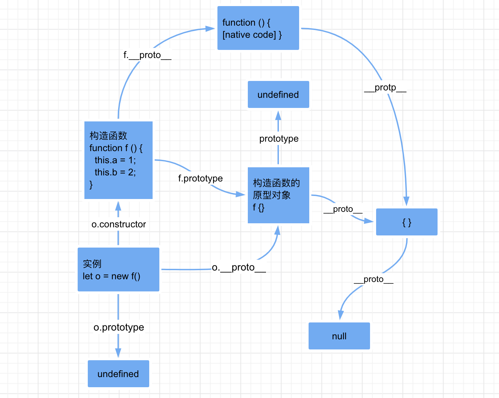

JavaScript 是动态的，并且本身不提供一个 `class` 实现。（在 ES2015/ES6 中引入了 `class` 关键字，但那只是语法糖，JavaScript 仍然是基于原型的）。只有对象类型才有继承与原型概念。

[原型与原型链](ji-cheng-yu-yuan-xing.md)在其他文章详细讲述。

通常情况下，由构造器生成的对象，整个原型链如下: 



* 每个实例对象（ object ）都有一个私有属性（称之为 \_\_proto\_\_ ）指向它的构造函数的原型对象（**prototype** ）。
* 该原型对象也有一个自己的原型对象\( \_\_proto\_\_ \) ，层层向上直到一个对象的原型对象为 `null`。
* 根据定义，`null` 没有原型，并作为这个**原型链**中的最后一个环节。
* 几乎所有 JavaScript 中的对象都是位于原型链顶端的 [`Object`](https://developer.mozilla.org/zh-CN/docs/Web/JavaScript/Reference/Global_Objects/Object) 的实例。

继承，首先需要一个父类(Father)

```
function Father(name){
    // 属性
    this.name = name || 'father',

    // 实例方法
    this.sleep = function(){
        console.log(this.name+"正在睡觉");
    }
}

// 原型方法
Father.prototype.look = function(book){
    console.log(this.name + "正在看:" + book);
}
```

### 1. 原型链

原型链是实现继承最原始的模式，即通过prototype属性实现继承。

**原理**：将父类的实例作为子类的原型对象

```
function Son(){
}
Son.prototype = new Father()  // 相当于重写了Son的原型
Son.prototype.constructor = Son
var son = new Son()
son.sleep() // father正在睡觉
son.look('TV') // father正在看TV
```
**解析**

son实例在查找 `sleep`和`look`方法时，

- 首先在son对象自身中找。若对象自身没找到
- 然后在Son.prototype中找。若Son.prototype中没找到
- 继续往上一层，Son.prototype.__proto__(Fater.prototype)
- 依次类推，直到找到需要的属性或方法，或到达原型链顶端Object.prototype

因此son会在`Son.prototype`即father实例中找到`sleep`方法，在`Son.prototype.__proto__`中,找到`look`方法。

**注意事项**

通过原型链实现继承后，不能再使用字面量的方式创建原型对象(给原型增加函数或属性)，因为会覆盖原型链。

```
//子级-原型属性：继承父级
Son.prototype = new Father()
 
//不能像下面这样，这样会使得上面的代码无效
//因为这相当于重新创建了一个原型对象
Son.prototype = {
 getSonValue: function() {
  return this.sonProp
 }
}
```
**缺点**
- 原型链中的属性（基本数据类型和引用数据类型）会被所有实例共享的，即所有实例对象使用的是同一份数据，会相互影响。
- 无法向父级构造函数传参

```
var son = new Son()
var son1 = new Son()

son.__proto__.name = 'son';
son.sleep() // son正在睡觉
son.look('TV') // son正在看TV
son1.sleep(); // son正在睡觉
```
需要注意的是，如果直接变更继承自父类的**基本数据**类型的属性，不会影响到其他实例。

```
var son = new Son()
var son1 = new Son()

son.name = 'son'; // 赋值操作只会在son实例上新增属性，然后在查询name属性时，就不会追溯原型链
son.sleep() // son正在睡觉
son.look('TV') // son正在看TV
son1.sleep(); // father正在睡觉
```

如果父类中包含数组，变更数组内部的值，会影响其他实例

### 2.借用构造函数

**原理**：在子级构造函数中调用父级构造函数

该方法可以解决引用类型带来的问题。同时也可以解决传参问题。

```
function Father(name) {
 this.name = name || 'father
 this.arr = [1,2,3]
}
 
function Son(name) {
 //call的第一个函数是this指向的对象,即构造函数的实例对象
 Father.call(this, name)
 
 /*上面代码等同于下面这段代码：
 (function() {
  this.name = name || 'father
  this.arr = [1,2,3]
 }).call(this)
 */
}
 
var son1 = new Son('son1')
console.log(son1.name)  //son1
console.log(son1.arr) //1,2,3
 
var son2 = new Son('son2')
console.log(son1.name)  //son2
son2.arr.push(4)
 
console.log(son2.arr) //1,2,3,4
console.log(son1.arr) //1,2,3
```
**缺点**
- 破坏了复用性。因为每个实例都创建了一份副本，把父类私有的属性和方法，克隆一份一样的给子类私有的属性。
- Father执行的时候，把Father的中的this换成Son的实例，由于并不是new Father，所以son实例与Father.prototype上的属性无关。

### 3. 组合继承

组合继承 = 原型链 + 借用构造函数。取其长避其短：共享的用原型链，各自的借用构造函数。

```
function Father(name) {
 this.name = name
 this.arr = [1,2,3]
}
 
Father.prototype.getName = function() {
 console.log(this.name)
}

function Son(name, age) {
 Father.call(this, name)
 this.age = age
}

Son.prototype = new Father()
Son.prototype.constructor = Son
Son.prototype.getAge = function() {
 console.log(this.age)
}

var son1 = new Son("son1", 23)
son1.arr.push(4)
console.log(son1.arr) //1,2,3,4
son1.getName()    //son1
son1.getAge()     //23
 
var son2 = new Son("son2", 24)
console.log(son2.arr) //1,2,3
son2.getName()    //son2
son2.getAge()     //24
```

**解析**

借用构造函数部分：
```
Father.call(this, name) // name来自Father
this.age = age; // age来自Son
Son.prototype.constructor = Son
```
原型链部分：
```
Father.prototype.getName // getName方法来自Father.prototype
Son.prototype.getAge // getAge来自Son.prototype
```

### 4. 寄生组合式继承

在上面的组合式继承实现中，父级构造函数调用了两次。一次在创建子级的原型对象，另一次在子级构造函数内部。下面做些优化。

两种方式的实现都是通过 子级的prototype继承父级的prototype，区别在于组合式通过new Father() 实现；寄生组合式通过赋值实现。

```
function inheritPrototype(Son, Father) {
  //创建一个Father.prototype的副本赋值给 Son.prototype
  Son.prototype = Object.create(Father.prototype)
  // 重新指定原型的构造函数为Son
  Son.prototype.constructor = Son
}

function Father(name) {
  this.name = name
  this.arr = [1,2,3]
}

Father.prototype.getName = function() {
  console.log(this.name)
  return this.name;
}

function Son(name, age) {
  Father.call(this, name)
  this.age = age
}

inheritPrototype(Son, Father)

Son.prototype.getAge = function() {
  console.log(this.age)
  return this.age;
}

var son1 = new Son("son1", 23)
son1.getName()            //son1
son1.getAge()             //23
son1.arr.push(4)          
console.log(son1.arr)     //1,2,3,4

var son2 = new Son("son2", 24)
son2.getName()            //son2
son2.getAge()             //24
console.log(son2.arr)     //1,2,3

```

**注意**

在上面代码中，有一行`Son.prototype.constructor = Son`代码。

在测试中，发现去掉之后，除了在打印出来的原型链中，`Son.prototype.constructor`指向`Father`外，对代码执行无任何影响。

也不影响`instanceof`，因为`instanceof`运算符用于检测构造函数的 prototype 属性是否出现在某个实例对象的原型链上。`Son`和`Father`同时满足该条件。

如果有谁知道`js`在什么地方会用到`Son.prototype.constructor`，欢迎在下方留言。

### 5. 原型式继承

**原理** 

首先有一个基础对象，然后将基础对象作为原型对象来生成新对象。

```
//基础对象
var father = {
  name: "father",
  arr: [1,2,3]
}

var son1 = Object.create(father)
son1.name = "son1"
son1.arr.push(4)
console.log(son1.name)    //son1

var son2 = Object.create(father)
son2.name = "son2"
console.log(son2.name)    //son2
console.log(son2.arr)     //1,2,3,4，引用类型问题依然存在
```
也可以使用Object.create()的第二个参数传添加对象属性

```
var son1 = Object.create(father, {
  name: {
    value: "son1"
  }
})
```
**缺点**

- 原型式继承解决了原型链无法传参的问题，但只在没必要使用构造函数时可以采用这种方法。

- 引用类型问题依旧存在


在参考文档中，还有一种寄生式。可以理解为是原型式继承的增强。在原型式继承中我们创建了一个新对象，寄生式继承便是在新对象中添加方法，本质上是一样的，此处不再介绍。


### 参考文档

1. [JS 继承的几种方式](https://zhuanlan.zhihu.com/p/62278342)
2. [【JS系列】继承的这6种方式！(上)
](https://blog.csdn.net/zwli96/article/details/89515124?spm=1001.2014.3001.5501)
3. [JS系列】继承的这6种方式！(下)](https://blog.csdn.net/zwli96/article/details/89515193)
